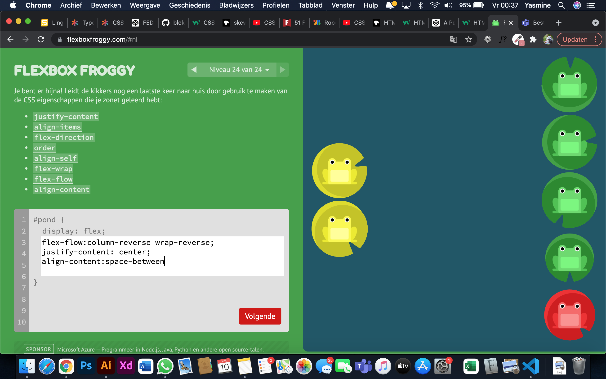
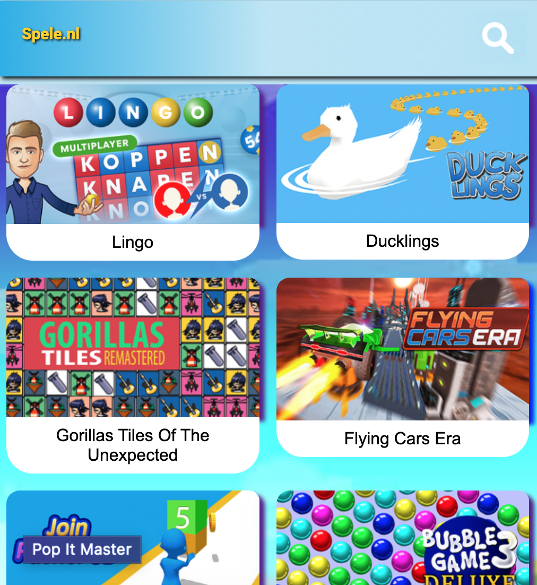

# Procesverslag
Markdown is een simpele manier om HTML te schrijven.  
 Markdown cheat cheet: [Hulp bij het schrijven van Markdown](https://github.com/adam-p/markdown-here/wiki/Markdown-Cheatsheet).

 Nb. De standaardstructuur en de spartaanse opmaak van de README.md zijn helemaal prima. Het gaat om de inhoud van je procesverslag. Besteedt de tijd voor pracht en praal aan je website.

 Nb. Door *open* toe te voegen aan een *details* element kun je deze standaard open zetten. Fijn om dat steeds voor de relevante stuk(ken) te doen.

## Jij

Hi

### Auteur:
Ik ben Yasmine Yakubi

#### Je startniveau:
Mijn start niveua is de blauwe piste. Voor dat ik op deze opleiding kwam wist ik nog niks over codering, nu weet ik nog wel het een en het ander maar kan het zijn dat ik veel ben vergeten. Dus wil ik het een en ander weer wat ophelderen.

#### Je focus:
 Mijn keus ligt voorlopig op de focus :Responsive. Later in het proces kan het zijn dat dit in combinatie gaat met surface plane of kan het alleen "surface plane" worden.
 

## Je website

uitwerken voor kick-off werkgroep

### Je opdracht:
link naar de website die ik ga namaken:
https://spele.nl/

#### Screenshot(s) van de eerste pagina (small screen): 
Homepage

#### Screenshot(s) van de tweede pagina (small screen):
Gamepage

 
 oefening:
 
 

 

## Breakdownschets (week 1)

 

uitwerken na afloop 2e werkgroep

### pagina een: 

### pagina twee: 

## Voortgang 1 (week 2)

1e voortgang

### Stand van zaken

Ik vond het leuk om de site steeds meer te zien groeien, de ruimte in de navigatiebar ging moeilijk en grid in de main.
  
 
  

## Voortgang 2 (week 3)

Voortgang 2

Ik heb de feedback verwerkt en ben aan de slag gegaan met grid en de navigatiebar
De navbar heb ik geprobeerd te verbeteren, met de echte logo, een burger menu en search button.

## Toegankelijkheidstest (week 4)

Door de testen ben ik er achter gekomen dat door een site navigeren soms inderdaad moeilijk kan zijn voor mensen met een beperking.

 

### Bevindingen
Lijst met je bevindingen die in de test naar voren kwamen:
Elastiek is moeilijk om met pijltjes te navigeren, en te typen. Je hebt bijvoorbeeld 2 handen nodig om simpele taken te doen zoals, shift tab. Dat zou je normaal gesproken met je wijsvinger en middelvinger.

#### Brillen
Met de brillen oefening kan ik me voorstellen om bijvoorbeeld teksten moeilijk te lezen kunnen zijn.

#### Elastiekjes 

 
Elastiek is moeilijk om met pijltjes te navigeren, en te typen. Je hebt bijvoorbeeld 2 handen nodig om simpele taken te doen zoals, shift tab. Dat zou je normaal gesproken met je wijsvinger en middelvinger doen.

#### Ballon 
Ik heb een parkingson apparaatje uitgeprobeerd en mijn site genavigeerd. Het was pijnlijk en moeilijk te navigeren. Ik kon geen foto maken, door de trillingen.

 
 Wat ik heb ontdekt is dat de screenreader per onderdeel teveel opnoemt, zoals sectie img jetpack.

## Voortgang 3 (week 4)

3e voortgang

### Stand van zaken
Het was lastig om de burger menu te laten uitklappen.
 

 

 
 
 Dit zijn de schermen tot nu toe.
 
 

 

## Eindgesprek (week 5)

uitwerken voor eindgesprek

### Stand van zaken
hier dit ging goed & dit was lastig (neem ook screenshots op van delen van je website en code)
Eindresultaat is responsive met een aantal surface plane faciliteiten.
 Het was moeilijk om te werken met nth of type want ik kreeg veel errors of het werkte niet mee, dus maakte ik er id's/classes van.
 
Eindresultaat:

 
 
 
 
 
 
 
 
 

## Bronnenlijst

1. bron 1 typografie geofend met dit youtube filmpje https://www.youtube.com/watch?v=RNakAX3rVVw
2. bron 2 Handig om onbekende html elementen op te sporen https://www.w3schools.com/ 
3. bron 3 Met Froggy heb ik flexbox geoefend https://flexboxfroggy.com/#nl 
4  bron 4 Met Grid Garden heb ik grid geoefend https://cssgridgarden.com/#nl
5. bron 5 star rating van https://codepen.io/hesguru/pen/BaybqXv?editors=0110
6. bron 5 hover info https://www.w3schools.com/howto/howto_css_transition_hover.asp
7. bron 7 jump animatie idee  https://codepen.io/shooft/pen/GREjemg
8. bron 8 font in css toevoegen https://www.pagecloud.com/blog/how-to-add-custom-fonts-to-any-website

